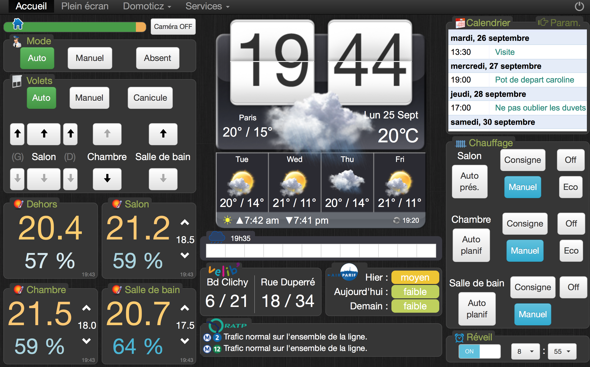

# smart-home-frontend

## Description
* Provide a front end dashboard for a smart home, based on:
  * Domoticz server
  * jdigiclock
  * Meteofrance pluie à 1 heure
  * Taux d'occupation de 2 stations vélib
  * Airparif : pollution à Paris
  * Statut de 2 lignes de métro Paris

## Preview

## Utilisation
### Détection présence

### Changement pile module RF

